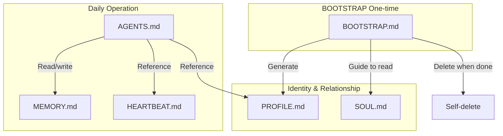

# Agent Prompt Files

CoPaw's Agent behavior is defined by a set of Markdown files in the working directory. These files form the Agent's "memory" and "personality," enabling context continuity across sessions.

> This Prompt design is inspired by [OpenClaw](https://github.com/openclaw/openclaw).

---

## File Overview

| File             | Core Role                               | Read/Write                         | Key Content                                                                 |
| ---------------- | --------------------------------------- | ---------------------------------- | --------------------------------------------------------------------------- |
| **SOUL.md**      | Defines Agent **values and behavior**    | Read-only (predefined by user)     | Be genuinely helpful; have opinions; be resourceful; respect privacy          |
| **PROFILE.md**   | Records Agent **identity** and **user profile** | Read/write (BOOTSTRAP, then manual) | Agent: name, role, style; User: name, timezone, preferences, background      |
| **BOOTSTRAP.md** | **First-run onboarding** for new Agent   | One-time (self-deletes when done)  | ① Intro → ② Learn user → ③ Write PROFILE.md → ④ Read SOUL.md → ⑤ Self-delete |
| **AGENTS.md**    | Agent's **full work guidelines**         | Read-only (daily reference)        | Memory rules; safety; tool usage; Heartbeat logic; boundaries               |
| **MEMORY.md**    | Stores **tool setup and lessons learned**| Read/write (Agent-maintained)      | SSH config; local paths; user preferences                                   |
| **HEARTBEAT.md** | Defines **background check-in tasks**   | Read/write (empty = skip heartbeat)| Empty → no check; content → run checklist at configured interval            |

---

## File Collaboration



**In one sentence:** SOUL defines character, PROFILE remembers relationships, BOOTSTRAP handles birth, AGENTS defines behavior, MEMORY accumulates experience, HEARTBEAT keeps vigilance.

---

## File Locations

- **Default working directory:** `~/.copaw` (override via `COPAW_WORKING_DIR`)
- **Template source:** `copaw init` copies from `agents/md_files/zh` or `agents/md_files/en` based on `agents.language`
- **Required files:** `SOUL.md` and `AGENTS.md` are the minimum; if missing, Agent falls back to a generic "You are a helpful assistant" prompt

---

## File Details

### SOUL.md — Soul and Principles

Defines Agent values, boundaries, and style. Examples:

- Be genuinely helpful, not performative
- Have opinions, don't blindly follow
- Be resourceful before asking
- Respect privacy, don't overstep

Templates are copied during `copaw init`. Edit via Console **Agent → Persona** or directly in the working directory.

---

### PROFILE.md — Identity and User Profile

Records "who you are" and "who the user is":

- **Identity:** Agent name, role, style
- **User profile:** Name, how to address them, timezone, background, preferences

Generated by BOOTSTRAP on first run; update via Console or by editing the file.

---

### BOOTSTRAP.md — First-run Onboarding

The Agent's "birth ritual." Flow:

1. Introduce yourself, ask about the user
2. Learn name, how to address them, timezone, etc.
3. Write to `PROFILE.md`
4. Read `SOUL.md` together, discuss preferences and boundaries
5. **Self-delete** `BOOTSTRAP.md` when done

This file exists only on first run; it deletes itself after onboarding.

---

### AGENTS.md — Work Guidelines

The Agent's daily handbook. Covers:

- Memory read/write rules (`MEMORY.md`, `memory/YYYY-MM-DD.md`)
- Safety and permissions (internal vs external actions)
- Tool usage guidelines
- Heartbeat and Cron trigger logic
- Boundaries and caveats

---

### MEMORY.md — Long-term Memory

Stores the Agent's "cheat sheet": tool setup, lessons learned, user preferences.

- Examples: SSH hosts and aliases, local paths
- Agent updates via `read_file` / `write_file` / `edit_file`
- Can be edited manually

---

### HEARTBEAT.md — Heartbeat Tasks

Defines the checklist for each heartbeat run. Example:

```markdown
# Heartbeat checklist

- Scan inbox for urgent emails
- Check calendar for next 2h
- See if any todos are stuck
- Light check-in if quiet for 8h
```

- **Empty file:** Skip heartbeat
- **With content:** Run at interval in `config.json` → `agents.defaults.heartbeat`

See [Heartbeat](./heartbeat) for details.

---

## Customizing Agent Persona

1. **Edit SOUL.md:** Adjust values, boundaries, style
2. **Edit PROFILE.md:** Update Agent identity and user profile
3. **Edit AGENTS.md:** Add or change work guidelines (use with care; affects global behavior)
4. **Via Console:** Edit in **Agent → Persona**

Changes take effect on the next conversation.

---

## Related Pages

- [Introduction](./intro) — What CoPaw does
- [Config & working dir](./config) — Working directory and config.json
- [Heartbeat](./heartbeat) — HEARTBEAT.md and heartbeat config
- [Memory](./memory) — Memory system and retrieval
