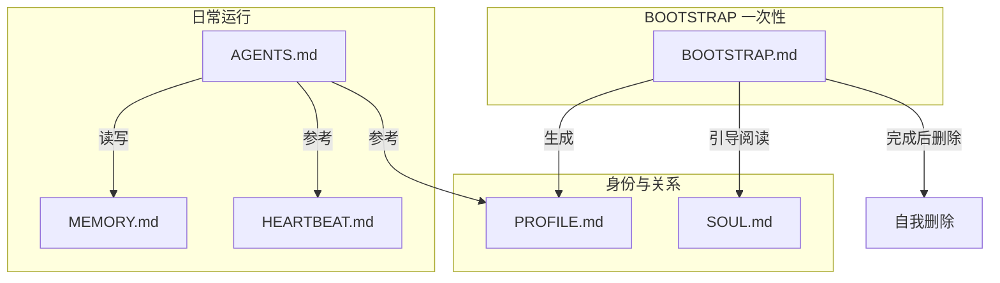

# Agent Prompt 文件

CoPaw 的 Agent 行为由工作目录下的一组 Markdown 文件定义。这些文件构成 Agent 的「记忆」与「人格」，让每次会话都能延续上下文。

> 本部分 Prompt 设计受 [OpenClaw](https://github.com/openclaw/openclaw) 启发。

---

## 文件一览

| 文件             | 核心职责                            | 读写属性                                           | 关键内容                                                                  |
| ---------------- | ----------------------------------- | -------------------------------------------------- | ------------------------------------------------------------------------- |
| **SOUL.md**      | 定义 Agent 的**价值观与行为准则**   | 只读（由开发者/用户预先定义）                      | 真心帮忙不敷衍；有自己的观点不盲从；先自己想办法再问人；尊重隐私不越权    |
| **PROFILE.md**   | 记录 Agent 的**身份**和**用户画像** | 读写（BOOTSTRAP 自动生成，之后可手动或控制台修改） | Agent 侧：名字、定位、风格、能力范围；用户侧：名字、时区、偏好、背景      |
| **BOOTSTRAP.md** | 新 Agent 的**首次运行引导流程**     | 一次性（引导完成后自我删除 ✂️）                    | ① 自我介绍 → ② 了解用户 → ③ 写入 PROFILE.md → ④ 阅读 SOUL.md → ⑤ 自我删除 |
| **AGENTS.md**    | Agent 的**完整工作规范**            | 只读（日常运行核心参考）                           | 记忆系统读写规则；安全与权限；工具调用规范；Heartbeat 触发逻辑；操作边界  |
| **MEMORY.md**    | 存储 Agent 的**工具设置与经验教训** | 读写（Agent 自行维护，也可手动编辑）               | SSH 配置与连接信息；本地环境路径/版本；用户个性化设置与偏好               |
| **HEARTBEAT.md** | 定义 Agent 的**后台巡检任务**       | 读写（空文件 = 跳过心跳）                          | 空文件 → 不巡检；写入任务 → 按配置间隔自动执行清单                        |

---

## 文件协作关系



**一句话总结：** SOUL 决定性格，PROFILE 记住关系，BOOTSTRAP 完成出生，AGENTS 规定行为，MEMORY 积累经验，HEARTBEAT 保持警觉。

---

## 文件位置

- **默认工作目录**：`~/.copaw`（可通过 `COPAW_WORKING_DIR` 环境变量修改）
- **模板来源**：`copaw init` 时根据 `agents.language`（`zh` / `en`）从 `agents/md_files/zh` 或 `agents/md_files/en` 复制到工作目录
- **必需文件**：`SOUL.md` 和 `AGENTS.md` 是 Agent 系统提示词的最低要求；若不存在，Agent 会退回到通用的 "You are a helpful assistant" 提示

---

## 各文件详解

### SOUL.md — 灵魂与准则

定义 Agent 的价值观、边界和风格。例如：

- 真心帮忙，不敷衍
- 有自己的观点，不盲从
- 先自己想办法，再问人
- 尊重隐私，不越权

运行 `copaw init` 时会复制模板。之后可在控制台 **智能体 → 人设** 中编辑，或直接修改工作目录下的文件。

---

### PROFILE.md — 身份与用户画像

记录「你是谁」和「用户是谁」：

- **身份**：Agent 的名字、定位、风格
- **用户资料**：用户名字、称呼、时区、背景、偏好

首次由 BOOTSTRAP 引导生成；之后可在控制台或直接编辑文件更新。

---

### BOOTSTRAP.md — 首次引导

新 Agent 的「出生仪式」。引导流程：

1. 自我介绍，询问用户身份
2. 了解用户的名字、称呼、时区等
3. 将信息写入 `PROFILE.md`
4. 一起阅读 `SOUL.md`，讨论偏好与边界
5. 完成后**自我删除** `BOOTSTRAP.md`

该文件只在首次运行存在；引导完成后即被删除。

---

### AGENTS.md — 工作规范

Agent 的日常行为手册，包含：

- 记忆系统读写规则（`MEMORY.md`、`memory/YYYY-MM-DD.md`）
- 安全与权限（内部 vs 外部操作）
- 工具调用规范
- Heartbeat 与 Cron 的触发逻辑
- 操作边界与注意事项

---

### MEMORY.md — 长期记忆

存储 Agent 的「小抄」：工具设置、经验教训、用户偏好等。

- 例如：SSH 主机与别名、本地环境路径等
- Agent 通过 `read_file` / `write_file` / `edit_file` 更新
- 可手动编辑

---

### HEARTBEAT.md — 心跳任务

定义每次心跳要执行的清单。例如：

```markdown
# Heartbeat checklist

- 扫描收件箱紧急邮件
- 查看未来 2h 的日历
- 检查待办是否卡住
- 若安静超过 8h，轻量 check-in
```

- **空文件**：跳过心跳
- **有内容**：按 `config.json` 中 `agents.defaults.heartbeat` 的间隔执行

详见 [心跳](./heartbeat)。

---

## 自定义 Agent 人设

1. **修改 SOUL.md**：调整价值观、边界、风格
2. **修改 PROFILE.md**：更新 Agent 身份与用户画像
3. **修改 AGENTS.md**：增加或调整工作规范（谨慎，影响全局行为）
4. **通过控制台**：在 **智能体 → 人设** 中编辑对应文件

修改后保存即可；下次对话会加载新内容。

---

## 相关页面

- [项目介绍](./intro) — CoPaw 可以做什么
- [配置与工作目录](./config) — 工作目录与 config.json
- [心跳](./heartbeat) — HEARTBEAT.md 与心跳配置
- [记忆](./memory) — 记忆系统与检索
